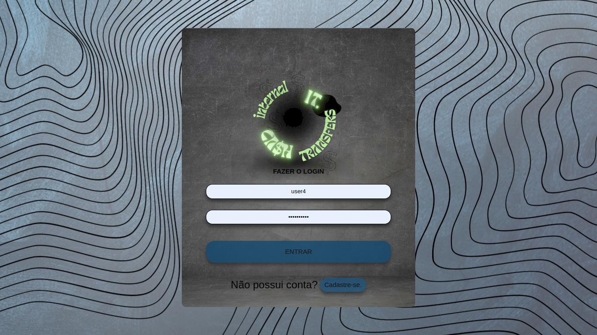
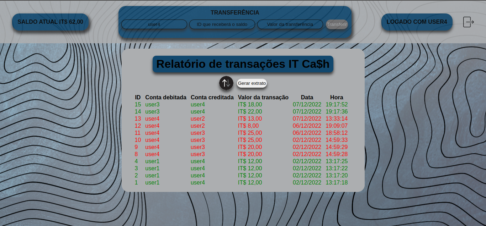

# Boas-vindas ao repositório do projeto Internal Transfers!
 - Uma aplicação para transferencia entre usuários cadastrados.

 ## Características
 - Permite a criação de usuário.
 - Permite login de usuário cadastrado
 - Conferir saldo atual.
 - Ver transações realizadas.
 - Transferir saldo para outra pessoa.

## Intuito do projeto
  - Permitir que usuários cadastrados possam transferir e receber IT$. Com segurança e eficiência.

## Ferramentas e bibliotecas utilizdas

## READMEs

- [README frontend](frontend/README.md)
- [README backend](backend/README.md)

# Páginas

## Tela de registro de usuário:
> /user/register

## Tela de login de usuário:
> /user/login

## Tela de lista de transações por usuário:
> /user/logged

