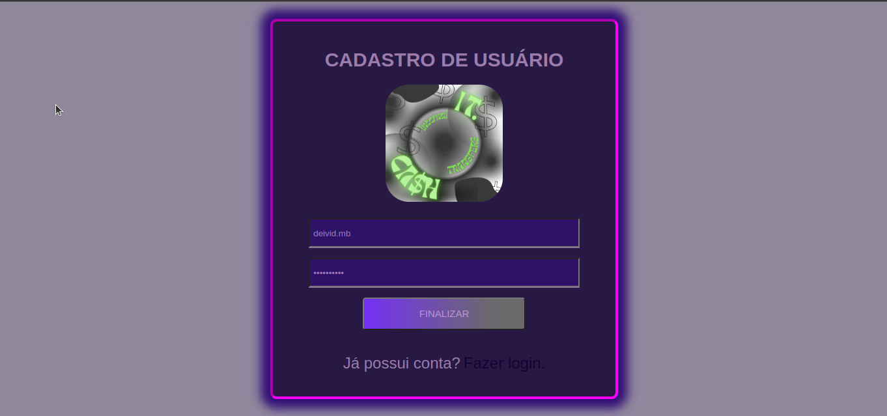
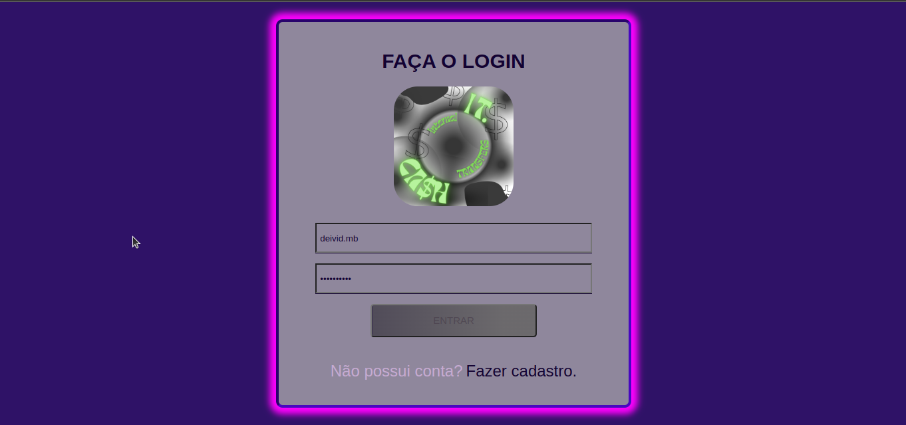

# Boas-vindas ao repositório frontend do projeto Internal Transfers!
  Sistema frontend para o projeto Internal Transfers.

## Features
- [x] Tela de criação de usuário.
- [x] Tela de login de usuário.
- [x] Tela para transferências e relatórios

## Pré-requisitos para rodar a aplicação

Antes de começar, você vai precisar ter instalado em sua máquina as seguintes ferramentas:  

## Começando:

Antes de começar siga os passos a seguir:

- Clone o repositório
~~~Java
git@github.com:DeividBorges93/Internal_Transfers.git
~~~

- Entre na pasta do frontend
~~~Java
cd /Internal_Transfers/frontend
~~~

- Instale as dependencias
~~~Java
npm install
~~~

## Sem Docker

- Inicie a aplicação
~~~Java
npm start
~~~

## Com Docker

- Na pasta raiz do projeto rode o comando
~~~Java
docker-compose up --build
~~~

## Páginas

### Tela de registro de usuário:
> /user/register

### Tela de login de usuário:
> /user/login

### Tela de lista de transações por usuário:
> /user/logged

